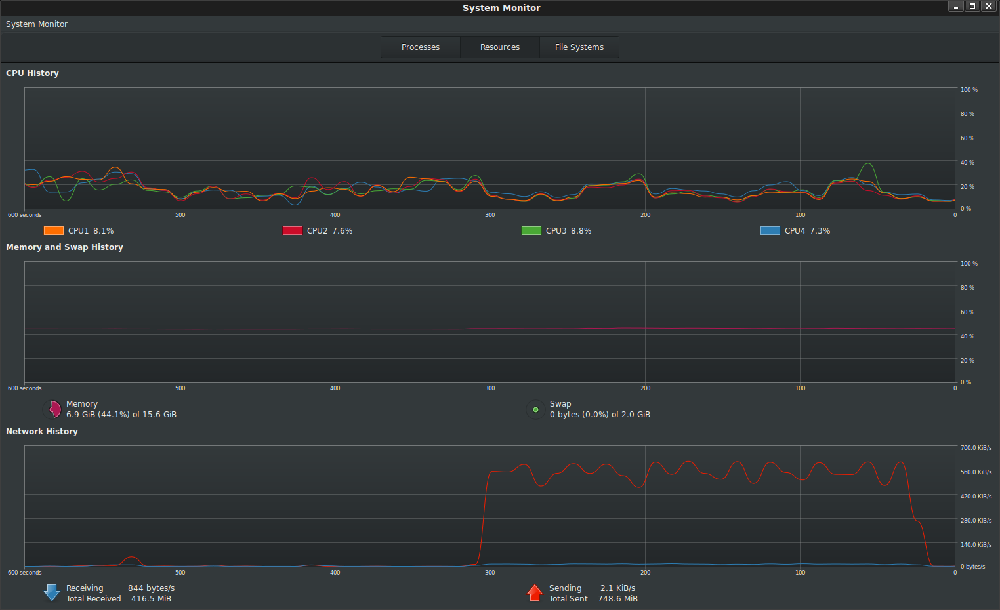
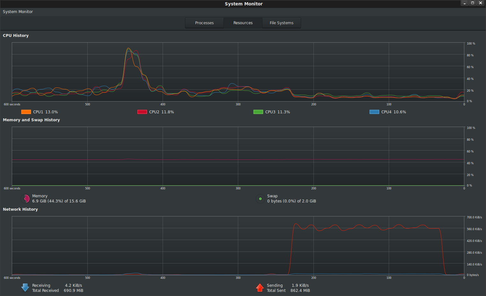

# GPG stream encryption and decryption on Google Cloud Functions and Cloud Run

About a year+ ago a colleague of mine ([Daz Wilkin](https://medium.com/@DazWilkin)) asked me how best to decompress/unzip a file using Google Cloud Functions.  The suggestion ended as a sample he provided demonstrating the `stream-read->stream-write` pattern with the pertinent input-outputs (input: unziped file; output zipped file).  The distinct advantage of stream processing the unzip function is that the data is never held in memory: as the unzipped content gets processed by GCF, its promptly written as a zip file to GCS.  He further went on to expand that [sample implementation in golang](https://medium.com/google-cloud/google-cloud-storage-exploder-2-9870d41fcee3) (and as a side note, I take credit for suggesting the 'exploder' name in the first article and the Caddyshack gopher in the second).  

So, a couple weeks ago another colleague asked how PGP encrypt a file using Cloud Functions.  Well, as you can imagine, you can apply the same stream technique there as well.  This article lifts Daz's code in golang and uses GPG libraries to encrypt or decrypt a file on GCS.

> Note: I know perfectly well GCS has [Customer Supplied Encryption](https://cloud.google.com/storage/docs/encryption/using-customer-supplied-keys) keys as well as KMS backed keys to do encryption hands free; this article is just an exercise demonstrating the stream-read-write capability with golang-PGP.   The intent is for you to expand this pattern for other stream processing systems with [Cloud Functions](https://cloud.google.com/functions/) or [Cloud Run](https://cloud.google.com/run/).

This article shows how to deploy a GPG `Encryption` and `Decryption` functions that read in a file in GCS, and as the names suggests, performs the named operations against the source file provided.

## References

Some really useful links to cite that helped with this article
* [GPG Encryption Sample in Golang](https://play.golang.org/p/vk58yYArMh)
* [Stream IO in golang](https://medium.com/learning-the-go-programming-language/streaming-io-in-go-d93507931185)
* [Daz's Cloud Storage "Exploder'](https://medium.com/google-cloud/google-cloud-storage-exploder-2-9870d41fcee3)
* [Goland OpenPGP](https://godoc.org/golang.org/x/crypto/openpgp)


## Installation

The following is just a sample that uses `symmetric` encryption (password-based). You can use the same technique and sample set to do asymmetric encrption as well.

### Setup

Ok, lets get started.  First we'll create a couple of GCS buckets:

```bash
export GOOGLE_PROJECT_ID=`gcloud config get-value core/project`
export BUCKET_SRC=`gcloud config get-value core/project`-gpg-src
export BUCKET_DEST=`gcloud config get-value core/project`-gpg-dest
export BUCKET_DEST_DEC=`gcloud config get-value core/project`-gpg-dest-dec
```

```bash
gsutil mb -c regional -l us-central1 -p ${GOOGLE_PROJECT_ID} gs://${BUCKET_SRC}
gsutil mb -c regional -l us-central1 -p ${GOOGLE_PROJECT_ID} gs://${BUCKET_DEST}
gsutil mb -c regional -l us-central1 -p ${GOOGLE_PROJECT_ID} gs://${BUCKET_DEST_DEC}
```

The source bucket (`BUCKET_SRC`) hosts plaintext files uploaded.  On upload that triggers the `Encrypt` function which writes the file to the `BUCKET_DEST` bucket.  Once the encrypted file is finalized, the `Decrypt` GCF function is automatically triggered.  The decrypted file gets written to the `BUCKET_DEST_DEC` bucket.  Essentially, this shows the full encrypt-decrypt cycle with GCF.

### Deploy functions

Deploy the GCF functions and set the maximum timeout (so that the function can encrypt/decrypt as much as possible)

```bash
gcloud  functions deploy Encrypter --entry-point=Encrypter --runtime go111 \
  --trigger-resource=${BUCKET_SRC} --set-env-vars=BUCKET_DST=${BUCKET_DEST} \
  --trigger-event=google.storage.object.finalize --project=${GOOGLE_PROJECT_ID} \
  --timeout=540s --memory=256MB

gcloud  functions deploy Decrypter --entry-point=Decrypter --runtime go111 \
  --trigger-resource=${BUCKET_DEST} --set-env-vars=BUCKET_DST=${BUCKET_DEST_DEC} \
  --trigger-event=google.storage.object.finalize --project=${GOOGLE_PROJECT_ID} \
  --timeout=540s --memory=256MB
```

### Test Encryption/Decryption

- Verify buckets are empty (yeah, we just created them)
```bash
$ gsutil ls gs://$BUCKET_SRC
$ gsutil ls gs://$BUCKET_DEST
$ gsutil ls gs://$BUCKET_DEST_DEC
```

- Crate plaintext file
Either:
```bash
$ echo "plain text stuff" > plain.txt
```
or generate random stuff:
```bash
base64 /dev/urandom | head -c 100000000 > plain.txt
```

- Upload plaintext file
```bash
$ gsutil cp plain.txt gs://$BUCKET_SRC/
```

- Repeatedly check when the encrypted file is finalized:
```bash
$ gsutil ls gs://$BUCKET_DEST
```

- You should see a file with the `.enc` suffix as its hardcoded into the GCF `Encryption` function
```bash
gs://$BUCKET_SRC-gpg-dest/plain.txt.enc
```

- Copy the file down and check its actually encrypted
```bash
$ gsutil cp gs://$BUCKET_SRC-gpg-dest/plain.txt.enc .
```

- Check file encryption:

```
$ more plain.txt.enc
-----BEGIN PGP MESSAGE-----

wy4ECQMIRpvX4dV/FQVgAQp2Q4ABp2oFhQP6JZ6W175kMWfr2s25EGmiUFiaX4hN
0uAB5Gpy1Yvolo5/0uf36tR4f/Hh6ZrgneAi4aru4HHioMluEeA25GsuEEprL1gU
MF0YEoHtGcjgfuBl4H3k9sURYHLxkq1qdfG+H1UQaOJRbdcw4ci7AA==
=cGor
-----END PGP MESSAGE-----
```

(yep, it is)

- Check for decrypted file at destination decryption bucket
```bash
$ gsutil ls gs://$BUCKET_DEST_DEC
gs://$BUCKET_DEST_DEC-gpg-dest-dec/plain.txt.enc.dec
```

- Download the source file and verify its the same

```bash
$ gsutil cp gs://$BUCKET_SRC-820-gpg-dest-dec/plain.txt.enc.dec .

$ more plain.txt.enc.dec
plain text stuff
```

## Soo..what just happened

The trick is to all this is stream IO...the bytes encrypted and decrypted are processed as a stream as they come in and promptly get sent out...not much stays in memory (certainly not the full file!)

In a very basic way

* `GCS File` -> `(GCS Stream)` --> `(Encrption Stream)` -> `(GCS Stream)` -> `GCS File`

* `GCS File` -> `(GCS Stream)` --> `(Decryption Stream)` -> `(GCS Stream)` -> `GCS File`

### Encryption

- Create a Reader for the source file that was uploaded

```go
func Encrypter(ctx context.Context, event Event) error {
  gcsSrcReader, err := gcsSrcObject.NewReader(ctx)
```

- Setup the target object to write to,
```golang
gcsDstObject := dstBucket.Object(event.Name + ".enc")
gcsDstWriter := gcsDstObject.NewWriter(ctx)
```

- Setup an `io.Pipe` intermediary

ok, so why are we doing this?  We need to redirect and gcs plaintext reader (`gcsSrcReader`) in such a way that its _written_ to the `SymmetricallyEncrypt` `plaintext io.WriteCloser`.  Once the data cleartext is written in, we need to take its output as a reader that will again feed into the GCS destination writer.

..and we need to do all this without having _all_ the file `bytes[]` completely in memory on either side; we just need the fraction in transit.  How we do this is creating a pipe between `openpgp` and both [`gcsSrcWriter`,`gcsDstWriter`] on either side.

so given the definition

```golang
Encode func(out io.Writer, blockType string, headers map[string]string) (w io.WriteCloser, err error)

SymmetricallyEncrypt func(ciphertext io.Writer, passphrase []byte, hints *FileHints, config *packet.Config) (plaintext io.WriteCloser, err error)

Pipe func() (*PipeReader, *PipeWriter)
  Pipe creates a synchronous in-memory pipe. It can be used to connect code expecting an io.Reader with code expecting an io.Writer.
```

we read in a stream, establish pipes (`pipeeader`, `pipewriter`) to glue and openpgp methods outputs for encryption then finally write out again as a stream:

```golang
pipeeader, pipewriter := io.Pipe()

go func() {
    defer pipewriter.Close()
    encodeWriteCloser, err := armor.Encode(pipewriter, "PGP MESSAGE", nil)
    plaintext, err := openpgp.SymmetricallyEncrypt(encodeWriteCloser, password, nil, packetConfig)

    io.Copy(plaintext, gcsSrcReader)

    plaintext.Close()
    wm.Close()		
}()

n, err := io.Copy(gcsDstWriter, pipeeader)

gcsDstWriter.Close()
```

### Decryption

Decryption is easier to pipe than Encryption since the decrypted data is already a reader:
(`messagedetails.UnverifiedBody` << returns a Reader already)


- Create source/destination object reader and writers:

```go
srcBucket := gcsClient.Bucket(event.Bucket)
dstBucket := gcsClient.Bucket(p.function.sink)

gcsSrcObject := srcBucket.Object(event.Name)
gcsSrcReader, err := gcsSrcObject.NewReader(ctx)
defer gcsSrcReader.Close()

gcsDstObject := dstBucket.Object(event.Name + ".dec")
gcsDstWriter := gcsDstObject.NewWriter(ctx)
```

- Set the source reader into GPGs decryption

```go
	armorBlock, err := armor.Decode(gcsSrcReader)
```

- Read and decrypt the source into the target

```go
md, err := openpgp.ReadMessage(armorBlock.Body, nil, prompt, packetConfig)

n, err := io.Copy(gcsDstWriter,md.UnverifiedBody)
gcsDstWriter.Close()
```

## Limits

There are always limits to everything...at the lowest level in this case, its the amount of time a given cloud function can run:  a GCF function can run at most
[9 minutes](https://cloud.google.com/functions/docs/concepts/exec#timeout) so whatever size of file you submit, it must fit into that window

Since the encrption/decryption is CPU bound, you can select different memory profiles depending on how fast you need it proccessed at cost.

The above deployment and latency below uses `--memory=2048MB`

- [GCF Compute Time](https://cloud.google.com/functions/pricing#compute_time)

For example, 

- symmetric encryption and decryption of various file sizes with a GCF default memory allocation of `256MB`


Which by extrapolation means you can at most process little over 1GB file for Encryption and maybe 1.5GB file for decryption (why the asymmetry, i dont know enough math or there's a subtle issue with implementation).

These are limits on GCF but if you choose to host it on another platform like GCE or GKE, you can process an arbitrary large file with this technique.

## Local Testing

Ive attached a standalone application `standalone/main.go` which does the full encryption/decryption pipeline in sequence against the local filesystem or to GCS.  Use that sample app to test/verify and experiment with the pipe IO.

The following shows a local plain text file of size 100MB encrypted and transmitted to GCS from my laptop.  

> *Note* there is no change in memory usage footprint during the transfer: all the bytes read from file and uploaded to GCS happens over the stream



The following shows a local encrypted  file of size  decrypted and transmitted to GCS from my laptop



## Deploying to Cloud Run

You can also deploy to Cloud Run


```
cd standalone/
```
edit main.go, change `bucketName`

then build, push, deploy

```
docker build -t gcr.io/<projectID>/gpgtest
docker push gcr.io/<projectID>/gpgtest

gcloud beta run deploy --image gcr.io/<projectID>/gpgtest --region=us-central1 --allow-unauthenticated --memory=128M
```

Finally invoke the cloud run deployment paths 

* `/encrypt?file=plain.txt`
* `/decrypt?file=plain.txt.enc`

## Conclusion

As before, this is just a sample showing how to stream-read-write...using openpgpg was really just a side show.
